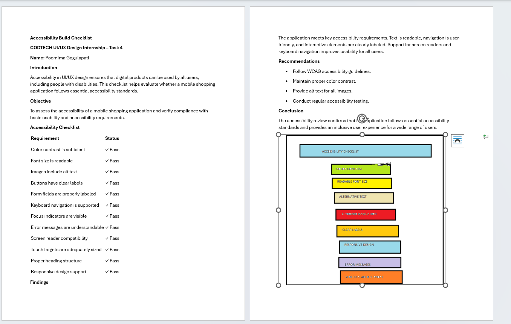
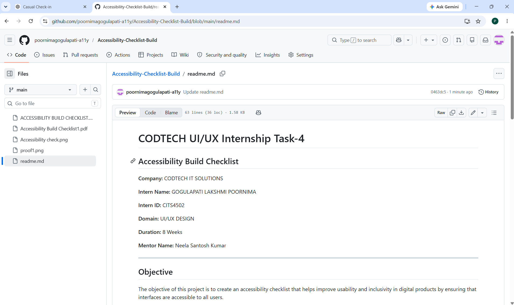

# CODTECH UI/UX Internship Task-4

## Accessibility Build Checklist

**Company:** CODTECH IT SOLUTIONS

**Intern Name:** GOGULAPATI LAKSHMI POORNIMA

**Intern ID:** CITS4502

**Domain:** UI/UX DESIGN

**Duration:** 8 Weeks

**Mentor Name:** Neela Santosh Kumar

---

## Objective

The objective of this project is to create an accessibility checklist that helps improve usability and inclusivity in digital products by ensuring that interfaces are accessible to all users.

---

## Description

This project provides a structured accessibility checklist covering important accessibility practices such as color contrast, readable typography, keyboard navigation, alternative text for images, responsive design, and screen reader compatibility. The checklist helps identify and verify accessibility requirements in a user interface.

---

## Tools Used

* Figma
* Microsoft Word / Canva
* WCAG Accessibility Guidelines

---

## Files in Repository

* Accessibility Build Checklist.pdf
* Accessibility Check.png
* proof1.png
* README.md

---

## Conclusion

Accessibility improves usability and ensures that digital products can be used effectively by a wider range of users, including people with disabilities. Following accessibility guidelines helps create inclusive and user-friendly experiences.

---

## Proof of Execution

### Proof 1 – Accessibility Checklist

### Proof 2 – Report Document

### Proof 3 – Task Completion Proof

